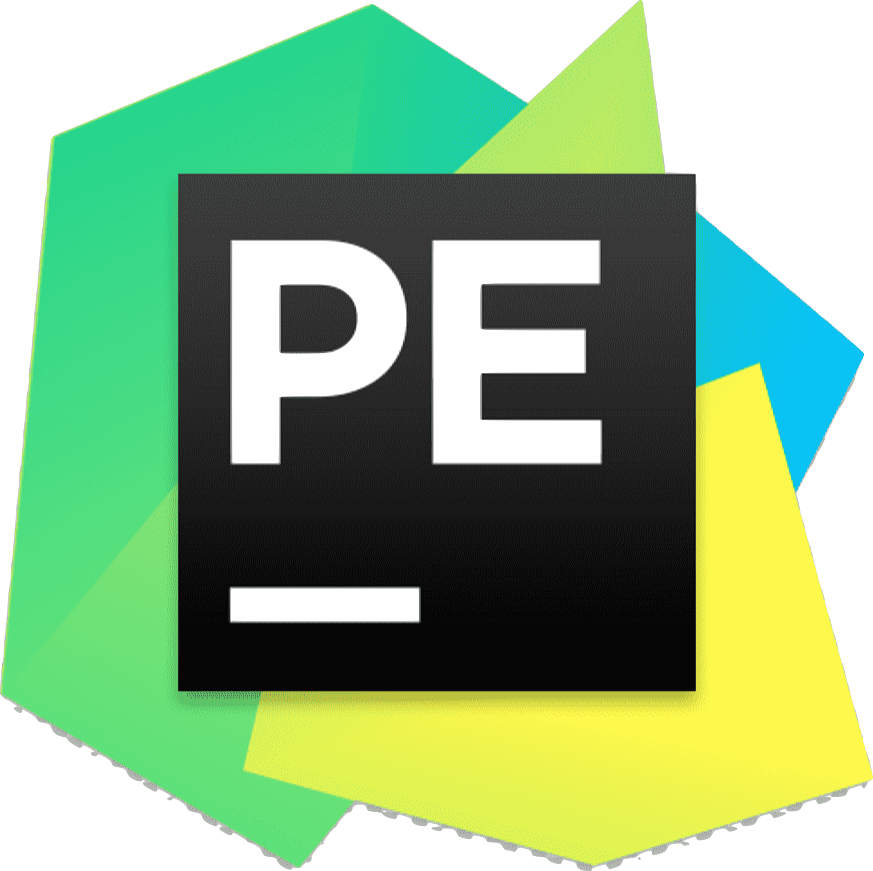

<h1 align="center"> Привет, меня зовут <a href="https://t.me/gartemKAF" target="_blank">Артем.</a>

### Немного обо мне:
- 🌱 в 2022 году я познакомился с Python и до сих пор изучаю его особенности и другие инструменты, которые позволяют создавать полезные и не очень программы;
- 🥅 цель на 2023 год - освоить Flask и познакомиться с мобильной разработкой;
- ⚡ в свободное от учебы и работы время увлекаюсь самодельничеством или, как это модно сейчас называть DIY;
- 👯 с удовольствием рассмотрю предложения принять участие в разработке веб-проекта на Django.

### Как со мной связаться:

&nbsp;&nbsp;

&nbsp;&nbsp;

### Языки программирования и инструменты:

&nbsp;&nbsp;

&nbsp;&nbsp;

&nbsp;&nbsp;

&nbsp;&nbsp;

### Немного статистики:

<table>
<tr>
<td>
<picture>
<source
  srcset="https://github-readme-stats.vercel.app/api/top-langs/?username=ArtemKAF&layout=compact"
/>

</picture>
</td>
<td>
  
</td>
</tr>
</table>
